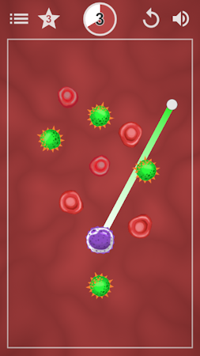

# Cut the Virus

<p align="center"></p>

## About

Cut the Virus is a **puzzle game** where the player controls the white blood cell with a purpose of eliminating the viruses. The player can **cut through** the viruses by pointing the end position for the cell. There are some **obstacles,** such as the blood and fat cells. The blood cells can be cut through, which results in a **penalty**. There are **12 levels** in total. Each level has a **time limit** and a **rating** based on the penalty. The lack of the penalty results in a full score.

You can **play in the browser** or **download for Windows and Android** by clicking [here](https://m-biernat.itch.io/cut-the-virus).

## Tools & Dependencies

 - [Unity 2019.3.5](https://unity.com/releases/editor/whats-new/2019.3.5) - game engine;
 - [LeanTween](https://assetstore.unity.com/packages/tools/animation/leantween-3595) - to animate stuff;
 - [Blender 2.81](https://www.blender.org/download/releases/2-81/) - to create 3D models.

*The project requires Blender installed because of ```.blend``` files.*

## Credits

 - **Michał Biernat** @[m-biernat](https://github.com/m-biernat) - game designer, programmer;
 - **Anna Hosumbek** @[An-Hos](https://github.com/An-Hos) - level designer, 3D artist.

BGM and SFX are from [Freesound.org](https://freesound.org/), licensed under [CC0](https://creativecommons.org/publicdomain/zero/1.0/).

## License

All rights reserved ([no license](https://choosealicense.com/no-permission/)): 
 - You **can** view (peek into the code and assets) and fork this repository;
 - You **cannot** reproduce, distribute, or create derivative works;
 - You **can** play the game (*"Cut the Virus"*) free of charge via the provided channels.
